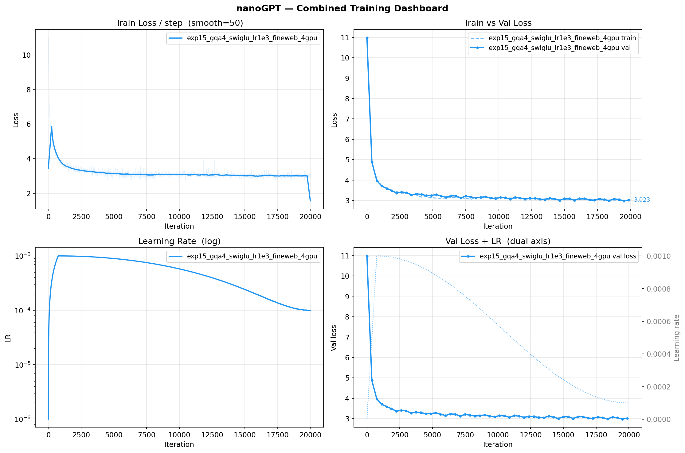
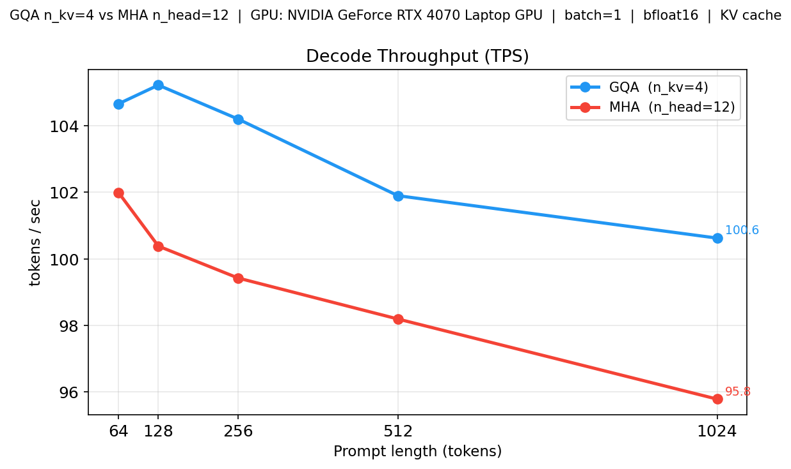
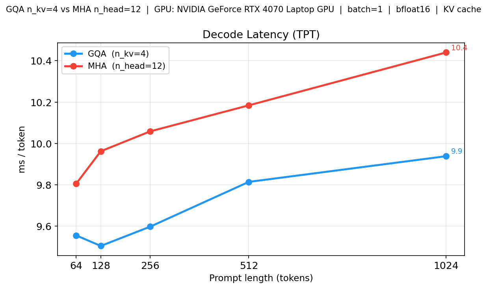
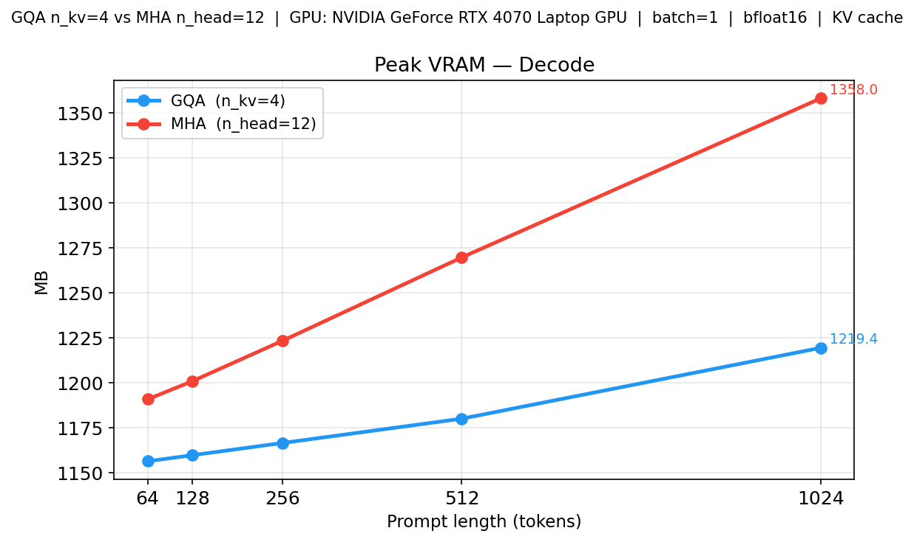
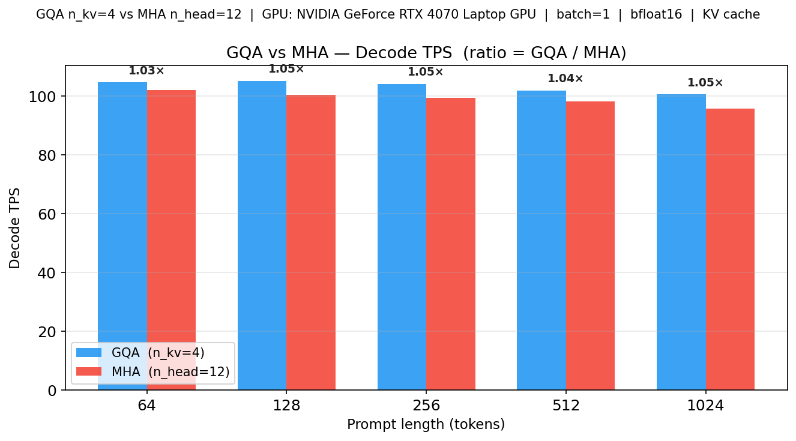

# nanoGPT — GQA + RoPE + SwiGLU


A fork of [Andrej Karpathy's nanoGPT](https://github.com/karpathy/nanoGPT) extended with modern LLM architecture improvements and multi-GPU training infrastructure:

- **Grouped Query Attention (GQA)** — multiple query heads share a single KV head, shrinking the KV cache
- **Rotary Position Embeddings (RoPE)** — replaces learned absolute position embeddings
- **SwiGLU MLP** — LLaMA-style gated activation replacing GELU
- **FSDP training** — real multi-GPU training with PyTorch Fully Sharded Data Parallel (parameters + gradients + optimizer state all sharded)
- **BPE tokenizer** — tiktoken GPT-2 BPE (vocab=50304) used throughout
- **HuggingFace streaming** — train on FineWeb-Edu 350BT without downloading anything locally
- **1B+ scale config** — ready-to-run experiment targeting ~1.2B parameters with Chinchilla-optimal token budget
- **Triton GQA kernels** — native prefill/decode kernels without `repeat_interleave` expansion

---

## Repository Layout

```
nanoGPT/
├── model.py                      # Original nanoGPT MHA model
├── model_gqa.py                  # GQA + RoPE + SwiGLU model (main model)
├── train.py                      # Original single-GPU training script (DDP)
├── train_fsdp.py                 # FSDP multi-GPU training (supports MHA and GQA)
├── configurator.py               # Config file + CLI override loader
├── triton_kernels.py             # Triton kernels: LayerNorm, GELU (original model)
├── triton_kernels_gqa.py         # Native Triton GQA prefill + decode kernels
├── eval/
│   ├── bench_inference.py        # GQA vs MHA KV cache benchmark
│   ├── bench.py                  # Original throughput benchmark
│   ├── bench_gqa.py              # GQA throughput benchmark
│   ├── bench_triton_vs_hf.py     # Triton vs HuggingFace attention comparison
│   ├── compare_accuracy.py       # Perplexity vs HuggingFace GPT-2
│   ├── plot_loss.py              # Training curve plots
│   ├── sample.py                 # Text generation (original model)
│   └── sample_gqa.py             # Text generation (GQA model)
├── config/
│   ├── train_shakespeare_gqa.py  # Quick single-GPU validation config
│   └── experiments/              # Per-experiment config files (exp01–exp17)
│       ├── base.py               # Shared base settings for Shakespeare experiments
│       ├── compare.py            # Print results table + plot
│       ├── run_all.sh            # Run all small experiments sequentially
│       ├── exp01_mha_abspe.py    # Baseline MHA + absolute PE
│       ├── exp02_gqa2_rope.py    # GQA n_kv=2 + RoPE
│       ├── exp03_gqa3_rope.py    # GQA n_kv=3 + RoPE
│       ├── exp04_mqa_rope.py     # MQA n_kv=1 + RoPE
│       ├── exp05_gqa2_rope500k.py # GQA n_kv=2 + RoPE base=500k
│       ├── ...                   # exp06–exp16: FineWeb runs and ablations
│       └── exp17_1b_gqa_swiglu_rope_multigpu.py  # 1B+ scale pretrain
└── data/
    ├── shakespeare_char/         # Character-level Shakespeare (quick tests)
    ├── shakespeare/              # Word-level Shakespeare
    ├── openwebtext/              # OpenWebText BPE preparation
    └── fineweb_edu/              # Streaming dataset prep for FineWeb-Edu
```

---

## Architecture: What Was Added

### Grouped Query Attention (GQA)

Standard MHA gives every query head its own Key and Value head. GQA groups queries so they share KV heads:

```
MHA: n_head=12              →  12 Q heads, 12 K heads, 12 V heads
GQA: n_head=12, n_kv_head=4 →  12 Q heads,  4 K heads,  4 V heads  (3× smaller KV cache)
MQA: n_head=12, n_kv_head=1 →  12 Q heads,  1 K head,   1 V head  (12× smaller KV cache)
```

The fused `c_attn` projection from the original nanoGPT is split into `q_proj` and `kv_proj`:

```python
# Original nanoGPT (MHA)
self.c_attn = nn.Linear(n_embd, 3 * n_embd)

# GQA
self.q_proj  = nn.Linear(n_embd, n_embd)
self.kv_proj = nn.Linear(n_embd, 2 * n_kv_head * head_dim)
```

KV heads are expanded before attention via `repeat_interleave`, or computed natively with the Triton kernels (no extra memory allocation).

**KV cache shape** is `(B, n_kv_head, T, head_dim)` — much smaller than MHA's `(B, n_head, T, head_dim)`.

### Rotary Position Embeddings (RoPE)

RoPE rotates Q and K vectors by a position-dependent angle rather than adding a learned embedding to the input:

- No learned `wpe` table — zero extra parameters
- Position offset-aware for correct KV cache decoding
- Better length generalisation than absolute PE
- Configurable `rope_base` (10000 = original, 500000 = LLaMA-3 long-context)

```python
class RotaryEmbedding(nn.Module):
    # Precomputes cos/sin tables up to max_seq_len
    # apply_rotary() applied to Q and K inside attention, before SDPA
```

### SwiGLU MLP

```python
# Original GELU MLP
x = gelu(c_fc(x))
x = c_proj(x)

# SwiGLU (LLaMA-style)
x = F.silu(gate_proj(x)) * up_proj(x)
x = down_proj(x)
```

Hidden dimension is scaled to `(2/3) × 4 × n_embd` (rounded to nearest 64) to keep parameter count equivalent to the standard MLP.

### Gradient Checkpointing

Activation recomputation during the backward pass. Enabled via `gradient_checkpointing=True` in the config. Saves ~30–40% GPU memory at ~20% compute cost — essential for 1B+ scale training.

---

## Tokenizer

All BPE runs use **tiktoken GPT-2 encoding**:

```python
enc = tiktoken.get_encoding('gpt2')   # vocab size = 50257
# padded to 50304 (nearest multiple of 64) for hardware efficiency
ids = enc.encode_ordinary(text)
ids.append(enc.eot_token)             # 50256 as document separator
```

Character-level encoding (vocab=65) is used only for quick Shakespeare tests (exp01–exp05).

---

## Training Infrastructure (`train_fsdp.py`)

### FSDP — Real Multi-GPU Sharding

`train_fsdp.py` uses PyTorch **Fully Sharded Data Parallel (FSDP)** — parameters, gradients, and optimizer states are all sharded across GPUs (ZeRO-3 equivalent). This is not DDP (which replicates all weights on every GPU).

```python
model = FSDP(
    model,
    auto_wrap_policy=transformer_auto_wrap_policy(transformer_layer_cls={BlockGQA}),
    mixed_precision=MixedPrecision(param_dtype=bfloat16, ...),
    sharding_strategy=ShardingStrategy.FULL_SHARD,
    backward_prefetch=BackwardPrefetch.BACKWARD_PRE,
    use_orig_params=True,
)
```

The script falls back to single-GPU automatically when not launched via `torchrun`.

### Key Config Switches

| Parameter | Default | Description |
|-----------|---------|-------------|
| `n_kv_head` | `0` | `0` = MHA; positive = GQA |
| `use_rope` | `True` | RoPE vs learned absolute PE |
| `use_swiglu` | `False` | SwiGLU vs GELU MLP |
| `rope_base` | `10000` | RoPE frequency base |
| `gradient_checkpointing` | `False` | Activation recompute (saves memory) |
| `init_from` | `'scratch'` | `'scratch'`, `'resume'`, `'weights_only'`, `'mha_to_gqa'`, `'gpt2*'` |
| `dataset` | `'openwebtext'` | Local bin file or `'hf:repo/name@config'` for streaming |

### HuggingFace Streaming Data

Datasets are streamed directly from HuggingFace — no local disk prep required:

```bash
dataset = 'hf:HuggingFaceFW/fineweb-edu'              # sample-10BT (default config)
dataset = 'hf:HuggingFaceFW/fineweb-edu@sample-350BT' # full 350BT variant
```

Each rank skips a different offset (`rank × 100003` docs) to ensure non-overlapping training data. Doc offsets are saved in checkpoints so streaming can be resumed exactly.

### LR Schedulers

| Scheduler | Config key | Description |
|-----------|-----------|-------------|
| Cosine | `'cosine'` | Single cosine decay, `learning_rate → min_lr` |
| Cosine restarts | `'cosine_restarts'` | Warm restarts with decaying peak LR |
| Cyclic triangular2 | `'cyclic_triangular2'` | Triangular cycles, amplitude halving each cycle |

### MHA → GQA Checkpoint Conversion

An existing MHA checkpoint can be converted to GQA without full retraining:

```python
model = GPTGQA.from_mha_checkpoint(ckpt_path, n_kv_head=4)
# Q rows: copied directly
# K/V rows: mean-pooled across groups of MHA heads into GQA heads
```

Set `init_from='mha_to_gqa'` to trigger this automatically.

### Logging

Every run writes:
- `out_dir/log.csv` — eval snapshots: `iter, train_loss, val_loss, lr, tokens_seen, run_name`
- `out_dir/log_steps.csv` — per-step training loss + LR
- Optional wandb: set `wandb_log=True`

---

## Instruction Fine-Tuning (`finetune_instruct.py`)

`finetune_instruct.py` takes a pretrained checkpoint and fine-tunes it on an instruction-following dataset.

### Key design

**Loss masking** — cross-entropy is computed only on response tokens. The prompt/instruction tokens are masked out (`ignore_index=-1`), so the model learns to produce answers, not memorise the prompt format.

```
### Instruction:
Explain what a transformer is.

### Response:
A transformer is...          ← loss computed here only
<|endoftext|>
```

**Prompt template** (Alpaca-style):
```
### Instruction:
{instruction}

### Input:          <- omitted when empty
{input}

### Response:
{output}<|endoftext|>
```

### Supported datasets

| Key | Dataset | Size | Notes |
|-----|---------|------|-------|
| `alpaca` | `tatsu-lab/alpaca` | 52K | Default, general instruction following |
| `tulu2` | `allenai/tulu-v2-sft-mixture` | 326K | Larger, diverse mix |
| `jsonl:<path>` | Local JSONL file | any | Each line: `{"instruction":..., "input":..., "output":...}` |

### Usage

```bash
# Single GPU — fine-tune a pretrained GQA checkpoint
python finetune_instruct.py \
    --ckpt_path=out_experiments/exp15_gqa4_swiglu_lr1e3_fineweb_4gpu/ckpt.pt \
    --out_dir=out_instruct/alpaca

# Multi-GPU (FSDP) — same script, launched with torchrun
torchrun --standalone --nproc_per_node=4 finetune_instruct.py \
    --ckpt_path=out_experiments/exp17_1b_gqa_swiglu_rope_multigpu/ckpt.pt \
    --out_dir=out_instruct/1b_alpaca \
    --batch_size=4 \
    --gradient_accumulation_steps=8

# Custom JSONL dataset
python finetune_instruct.py \
    --ckpt_path=out/ckpt.pt \
    --dataset=jsonl:data/my_instructions.jsonl \
    --out_dir=out_instruct/custom

# Generate after fine-tuning
python eval/sample_gqa.py \
    --out_dir=out_instruct/alpaca \
    --start="### Instruction:\nExplain what a transformer is.\n\n### Response:\n"
```

### Key parameters

| Parameter | Default | Description |
|-----------|---------|-------------|
| `ckpt_path` | — | **Required.** Path to pretrained checkpoint |
| `dataset` | `alpaca` | `alpaca`, `tulu2`, or `jsonl:<path>` |
| `max_seq_len` | `1024` | Truncate sequences longer than this |
| `batch_size` | `4` | Micro-batch per GPU |
| `gradient_accumulation_steps` | `8` | Grad accumulation (÷ world_size for FSDP) |
| `max_iters` | `3000` | Total gradient steps (~3 epochs over Alpaca) |
| `learning_rate` | `2e-5` | Fine-tuning LR (much lower than pretrain) |
| `compile` | `False` | `torch.compile` (off by default — shorter run) |

Checkpoints saved to `out_dir/ckpt.pt` include `instruct_config` metadata (dataset, LR, etc.) alongside the standard model/optimizer state, so they can be inspected or resumed.

---

## Experiments

All experiments use `train_fsdp.py` with configs in `config/experiments/`.

### Small-Scale Ablations (Shakespeare / FineWeb-Edu 10BT)

These run on a single GPU or 2–4× H100 and validate architecture choices before scaling up.

| Exp | Architecture | Dataset | Notes |
|-----|-------------|---------|-------|
| exp01 | MHA + absolute PE | shakespeare_char | Baseline |
| exp02 | GQA n_kv=2 + RoPE base=10k | shakespeare_char | |
| exp03 | GQA n_kv=3 + RoPE base=10k | shakespeare_char | |
| exp04 | MQA n_kv=1 + RoPE base=10k | shakespeare_char | |
| exp05 | GQA n_kv=2 + RoPE base=500k | shakespeare_char | Long-context RoPE |
| exp06 | GPT-2 MHA fine-tune | FineWeb-Edu | Load pretrained GPT-2 |
| exp07 | GPT-2 → GQA n_kv=2 fine-tune | FineWeb-Edu | MHA→GQA transfer |
| exp08 | GQA n_kv=4 + RoPE | FineWeb-Edu | Streaming verify |
| exp09 | GPT-2 → GQA n_kv=4 | FineWeb-Edu | Two-phase: recovery + fine-tune |
| exp10 | GPT-2-Large → GQA n_kv=4 | FineWeb-Edu | 345M scale |
| exp11 | GQA n_kv=4 from scratch | FineWeb-Edu | |
| exp12 | MHA from scratch | FineWeb-Edu | Baseline at scale |
| exp13 | GQA n_kv=4 + SwiGLU | FineWeb-Edu | First SwiGLU run |
| exp14 | GQA n_kv=4 + SwiGLU + lr=1e-3 | FineWeb-Edu | Higher LR |
| exp15 | GQA n_kv=4 + SwiGLU + lr=1e-3 | FineWeb-Edu | 2× H100 FSDP |
| exp16 | GQA n_kv=4 + SwiGLU (fast) | FineWeb-Edu local | 4× H100, local memmap |

### Main Multi-GPU Run (exp15) — 124M Params on FineWeb-Edu

The primary completed training run at GPT-2 Small scale with all modern improvements.

| Param | Value |
|-------|-------|
| Architecture | GQA n_kv=4, SwiGLU, RoPE base=10000 |
| n_layer / n_head / n_embd | 12 / 12 / 768 |
| block_size | 1024 |
| Parameters | ~124M |
| Effective batch | ~786K tokens/step (batch=48, accum=16, 2× GPU) |
| Optimizer | AdamW, lr=1e-3, cosine decay |
| max_iters | 20,000 (~14.7B tokens seen at best checkpoint) |
| **Best val loss** | **2.9786 (perplexity ≈ 19.7)** |

**Training curve:**

| Iter | Train Loss | Val Loss | Tokens Seen |
|------|-----------|---------|-------------|
| 0 | 10.980 | 10.979 | 0 |
| 375 | 4.894 | 4.879 | 276M |
| 750 | 4.034 | 3.970 | 553M |
| 1,500 | 3.593 | 3.591 | 1.1B |
| 3,000 | 3.334 | 3.382 | 2.2B |
| 6,000 | 3.123 | 3.153 | 4.4B |
| 10,875 | 3.121 | 3.064 | 8.0B |
| 15,750 | 3.046 | 3.008 | 11.6B |
| **19,500** | **3.014** | **2.979** | **14.4B** |



### 1B+ Scale Pretrain (exp17) — 4× A100 80GB

`config/experiments/exp17_1b_gqa_swiglu_rope_multigpu.py`

A ~1.2B parameter model trained from scratch with Chinchilla-optimal token budget, tuned for **4× A100 80GB**.

| Param | Value |
|-------|-------|
| Architecture | GQA n_kv=8 of 16, SwiGLU, RoPE base=500000 |
| n_layer / n_head / n_embd | 24 / 16 / 2048 |
| n_kv_head | 8 (2:1 GQA ratio) |
| block_size | 4096 |
| Parameters | ~1.2B |
| Dataset | FineWeb-Edu 350BT (HF streaming) |
| Tokenizer | BPE, tiktoken GPT-2, vocab=50304 |
| batch_size | 16 per GPU |
| gradient_accumulation_steps | 32 (÷ 4 GPUs = 8 steps/GPU) |
| Effective batch | **2,097,152 tokens/iter** (16 × 8 × 4 × 4096) |
| Token budget | ~25B tokens (Chinchilla-optimal for 1.2B) |
| max_iters | 12,000 |
| Optimizer | AdamW, lr=3e-4, cosine decay |
| FSDP | FULL_SHARD (params + grads + optimizer state sharded) |
| gradient_checkpointing | False (not needed on 80GB at batch=16, block=4096) |

**VRAM per GPU (estimated):**

| Component | Memory |
|-----------|--------|
| Model params (bf16, sharded ÷4) | ~0.6 GB |
| Optimizer states (fp32 Adam, sharded ÷4) | ~1.2 GB |
| Activations (batch=16, block=4096) | ~28 GB |
| Buffers + fragmentation | ~4 GB |
| **Peak total** | **~34 GB** (comfortable on 80GB) |

**Parameter breakdown:**
- Per block: q_proj (4.2M) + kv_proj (4.2M) + c_proj (4.2M) + SwiGLU gate+up (22.5M) + down (11.3M) ≈ 46M
- 24 blocks: ~1.1B + vocab embedding 50304×2048 ≈ 103M → **~1.2B total**

**Run:**
```bash
torchrun --standalone --nproc_per_node=4 train_fsdp.py \
    config/experiments/exp17_1b_gqa_swiglu_rope_multigpu.py
```

**Quick sanity check (500 iters, ~5 min):**
```bash
torchrun --standalone --nproc_per_node=4 train_fsdp.py \
    config/experiments/exp17_1b_gqa_swiglu_rope_multigpu.py \
    --max_iters=500 --eval_interval=100
```

#### Config changes vs original 8-GPU design

| Parameter | Original (8× GPU) | Updated (4× A100 80GB) | Reason |
|-----------|------------------|------------------------|--------|
| `block_size` | 2048 | **4096** | Longer context; RoPE base=500k handles it well |
| `batch_size` | 16 | **16** | Halved from 32 to absorb the 2× activation memory from block=4096 |
| `gradient_accumulation_steps` | 64 | **32** | 64÷8GPUs=8 steps ≡ 32÷4GPUs=8 steps — same effective batch |
| `gradient_checkpointing` | True | **False** | 80GB has enough headroom at batch=16; disabling saves ~15% step time |
| `hf_prefetch_batches` | 64 | **128** | A100s process batches faster; deeper prefetch prevents data stall |
| `hf_tokenizer_threads` | 4 | **8** | More CPU threads to keep the tokenizer pipeline fed |

The **effective batch stays exactly 2,097,152 tokens/iter** across both configurations — only the GPU count and per-GPU work distribution changed.

---

## KV Cache Benchmark: GQA vs MHA

**Script:** `eval/bench_inference.py`
**Hardware:** NVIDIA RTX 4070 Laptop 8GB | **Precision:** bfloat16 | **Batch:** 1

Both variants use the same `model_gqa.py` codebase. MHA is instantiated as `GPTGQA(n_kv_head=n_head)` — identical code path, only KV projection shape differs. This isolates the KV head count effect.

**KV cache sizes (full 1024-token context):**

| Variant | KV heads | KV cache / sequence |
|---------|----------|-------------------|
| GQA | 4 | 12.6 MB |
| MHA | 12 | 37.7 MB |
| **Savings** | | **25.1 MB (3.0× smaller)** |

**Results at prompt_len=512:**

| Metric | GQA (n_kv=4) | MHA (n_head=12) |
|--------|--------------|-----------------|
| TTFT (ms) | ~14 ms | ~14 ms |
| Prefill TPS | ~35,000 | ~35,000 |
| Decode ms/tok | ~9.1 ms | ~9.5 ms |
| Decode TPS | ~110 | ~105 |
| VRAM prefill (MB) | ~1090 | ~1120 |
| VRAM decode (MB) | ~1100 | ~1135 |






**Key takeaways:**
- Prefill latency is identical — compute-bound, not KV-size-bound
- Decode TPS ~5% higher for GQA — fewer KV tensors = less memory bandwidth per step
- VRAM ~30–40 MB lower for GQA — exactly the KV cache size difference
- At larger batch sizes and longer contexts the gap widens; production systems (LLaMA 2/3, Mistral) report 20–50% decode speedup from GQA

---

## Triton GQA Kernels

`triton_kernels_gqa.py` implements native GQA attention without `repeat_interleave`.

The default approach allocates a full `(B, n_head, T, head_dim)` tensor for K and V before SDPA — storing `n_groups×` more data than necessary. The Triton kernels operate on unexpanded K/V directly:

```
triton_gqa_prefill(q, k, v):
    Q: (B, n_head,    T, head_dim)
    K: (B, n_kv_head, T, head_dim)   # NOT expanded
    V: (B, n_kv_head, T, head_dim)
    kv_head = q_head // n_groups     # computed inside kernel
    Online softmax (Flash Attention style), BLOCK_M=64, BLOCK_N=32

triton_gqa_decode(q, k, v):
    Q: (B, n_head,    1, head_dim)   # single new token
    K: (B, n_kv_head, S, head_dim)  # full KV cache
    One program per (batch, q_head), attends across all S cached positions
```

Enable with `use_triton_attn=True` in the config (requires Triton to be installed).

---

## Running

### Prerequisites

```bash
pip install torch tiktoken datasets transformers
# Optional (for Triton kernels):
pip install triton
```

### Quick validation (single GPU, Shakespeare)

```bash
python data/shakespeare_char/prepare.py
python train_fsdp.py config/train_shakespeare_gqa.py
```

### Run all small ablation experiments (sequential)

```bash
bash config/experiments/run_all.sh
python config/experiments/compare.py --plot
```

### Multi-GPU training on FineWeb-Edu (124M, exp15)

```bash
# No data prep needed — streams from HuggingFace
torchrun --standalone --nproc_per_node=2 train_fsdp.py \
    config/experiments/exp15_gqa4_swiglu_lr1e3_fineweb_4gpu.py
```

### 1B+ pretrain from scratch (exp17)

```bash
# 4× A100 80GB (primary target):
torchrun --standalone --nproc_per_node=4 train_fsdp.py \
    config/experiments/exp17_1b_gqa_swiglu_rope_multigpu.py
```

### Text generation from checkpoint

```bash
python eval/sample_gqa.py \
    --ckpt_path=out_experiments/exp15_gqa4_swiglu_lr1e3_fineweb_4gpu/ckpt.pt \
    --num_samples=5 --max_new_tokens=200
```

### KV cache benchmark

```bash
python eval/bench_inference.py \
    --ckpt_path=out_experiments/exp15_gqa4_swiglu_lr1e3_fineweb_4gpu/ckpt.pt
```

### Plot training curve

```bash
python eval/plot_loss.py \
    --log_csv=out_experiments/exp15_gqa4_swiglu_lr1e3_fineweb_4gpu/log.csv
```

---

## References

- [GQA: Training Generalized Multi-Query Transformer Models from Multi-Head Checkpoints](https://arxiv.org/abs/2305.13245) — Ainslie et al., 2023
- [RoFormer: Enhanced Transformer with Rotary Position Embedding](https://arxiv.org/abs/2104.09864) — Su et al., 2021
- [GLU Variants Improve Transformer](https://arxiv.org/abs/2002.05202) — Shazeer, 2020
- [Flash Attention: Fast and Memory-Efficient Exact Attention with IO-Awareness](https://arxiv.org/abs/2205.14135) — Dao et al., 2022
- [LLaMA: Open and Efficient Foundation Language Models](https://arxiv.org/abs/2302.13971) — Touvron et al., 2023
- [Chinchilla: Training Compute-Optimal Large Language Models](https://arxiv.org/abs/2203.15556) — Hoffmann et al., 2022
- [nanoGPT](https://github.com/karpathy/nanoGPT) — Andrej Karpathy
- [FineWeb-Edu](https://huggingface.co/datasets/HuggingFaceFW/fineweb-edu) — HuggingFace
